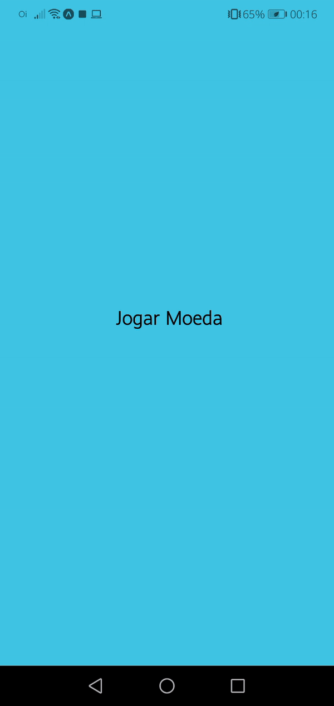

# <p align="center"> 🤠 Cara ou Coroa 🤡 </p>
<br />

# 🐱‍👤 Sobre

Um aplicativo simples criado com react-native
onde o usuário joga uma moeda, tendo a sorte de 
cair cara ou coroa.<br />

<div align="center">

</div> <br />
# 🔧 Ferramentas

* <a href="https://reactnative.dev/">React-Native</a>

* <a href="https://code.visualstudio.com/">Visual Studio Code</a>

* <a href="https://styled-components.com/">Styled Components</a><br />

  

# 🎱 Atributos 

* Recebe o click do usuário.

* Programa gera um número aleatório. 

* Programa exibe o resultado em imagem. <br/>

# 🏴‍☠️Como utilizar

<a href="./github/CalculadoraDeGorjeta-03420e78a41744b58173eb051659d0bf-signed.apk" download="Calculadora de gorjeta.apk">Clique aqui para baixar.</a>


  ```sh
$ git clone https://github.com/Scrowszinho/CaraOuCoroa
  ```

```sh
$ npm install
$ expo start
```